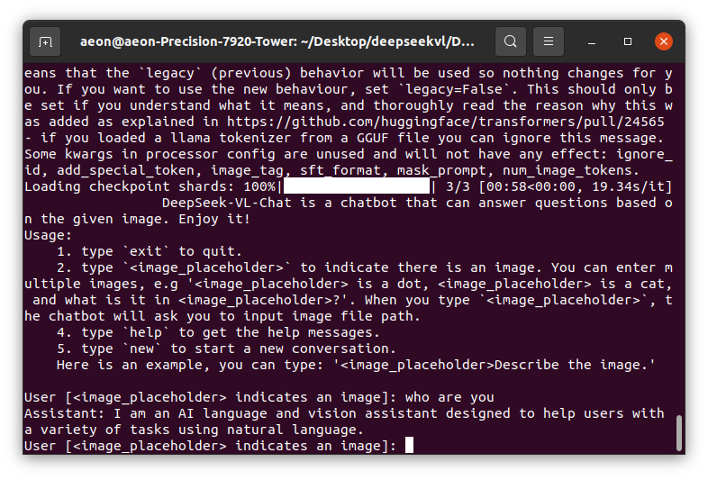

### 安装基于PyTorch的轻量级微调推理框架ms-swift

pip install swift

```
一些命令

swift web-ui --help
//不懂的命令查看help和文档

export ALL_PROXY=''
export all_proxy=''

//清空端口

watch -n 1 nvidia-smi 
//每一秒观看gpu显存情况
```

下载国产DeepSeek VL 7B

从github下载，huggingface下载7B权重。

cli 部署dpvl

--model_path "/home/aeon/Desktop/ds/deepseek-vl-7b-chat"



### 处理数据

查看官方对自定义数据集的要求，写脚本得到jason


回答部分还有问题，拿到串该split多余的符号

/home/aeon/Desktop/dataset/xraydata/DATA/chest_xray8/output.json

官方提供caption.sh进行微调，大约2days，2epoch。


watch -n 1 nvidia-smi    //每一秒观看gpu显存情况


train了18.5小时，evl loss和loss都没再变低了，stop。

###### CUDA_VISIBLE_DEVICES=0 swift export --ckpt_dir '/home/aeon/Desktop/ds/output/v0-20250114-135424/checkpoint-2500' --model_path '/home/aeon/Desktop/ds/deepseek-vl-7b-chat'  --model-type 'deepseek_vl'  --merge_lora true

## 融合

CUDA_VISIBLE_DEVICES=0 swift export \
    --model /home/aeon/Desktop/ds/deepseek-vl-7b-chat \
    --adapters /home/aeon/Desktop/ds/output/v0-20250114-135424/checkpoint-2500 \
    --merge_lora true

推理

CUDA_VISIBLE_DEVICES=0 swift infer \
    --ckpt_dir /home/aeon/Desktop/ds/output/v0-20250114-135424/checkpoint-2500-merged \
    --load_dataset_config true

CUDA_VISIBLE_DEVICES=0 swift deploy \
    --host 0.0.0.0 \
    --port 8000 \
    --adapters lora1=swift/test_lora lora2=swift/test_lora2 \
    --infer_backend vllm

CUDA_VISIBLE_DEVICES=0 swift web-ui \

    --host 0.0.0.0 \
    --port 8000 \

    --infer_backend vllm \

    --model /home/aeon/Desktop/ds/output/v0-20250114-135424/checkpoint-2500-merged

python cli_chat.py --model_path "/home/aeon/Desktop/ds/output/v0-20250114-135424/checkpoint-2500-merged"

"describe this pictrue </home/aeon/Desktop/dataset/00000001_000.png>"

部署到界面galio

CUDA_VISIBLE_DEVICES=0 \
swift app \
  --model '/home/aeon/Desktop/ds/output/v0-20250114-135424/checkpoint-2500-merged' \
  --infer_backend pt \
  --stream true \
  --max_new_tokens 2048


似乎不是很准。


它还是说英文


结尾总有一个符号】？


处理数据集的时候忘记split这个符号，以及去掉中间的‘’引用号

。。。。


7B占用有点高
